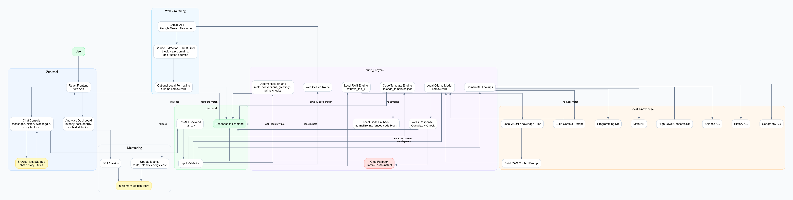
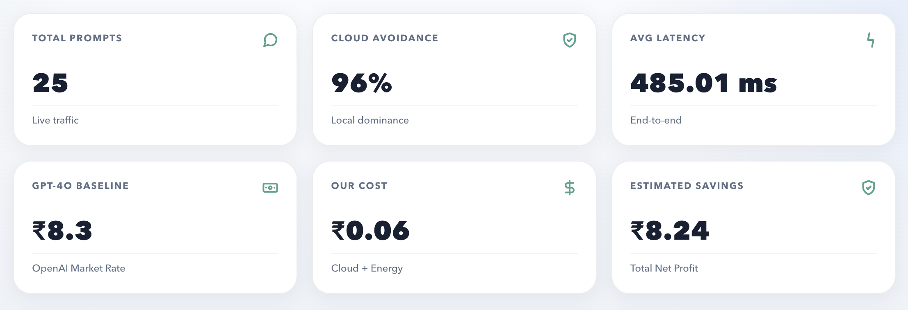
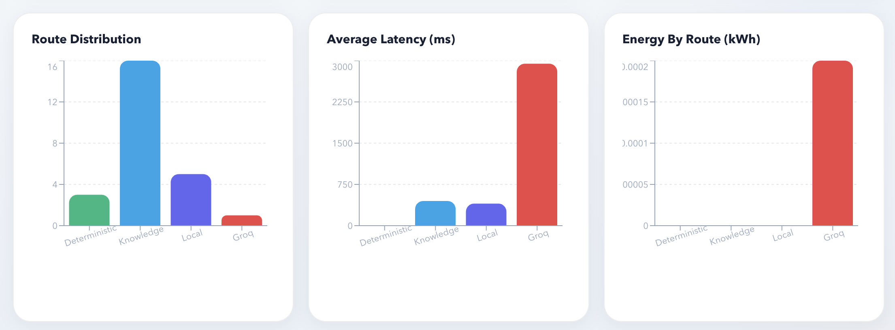
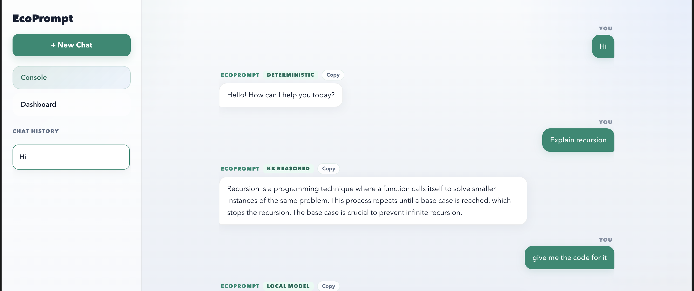
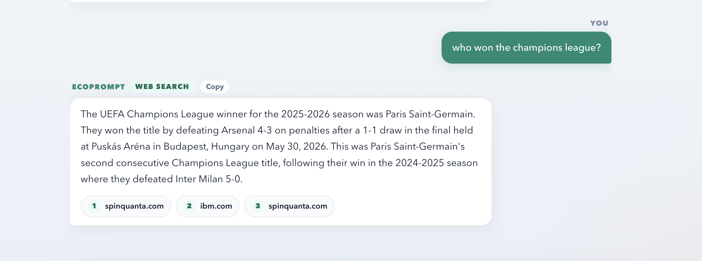

# EcoPrompt — Energy-Efficient AI Prompt Routing


> A hierarchical router that answers each prompt with the **cheapest, lowest-energy engine that can do the job** — sending trivial queries to deterministic/local handlers and reserving large LLMs only for prompts that genuinely need them. The result: lower latency, lower cost, and less compute/carbon per query.

**🔗 [Live demo](https://frontend-two-indol-16.vercel.app/)** &nbsp;·&nbsp; Frontend on Vercel · Backend on Google Cloud Run

Most apps send *every* prompt to a large model, even "what is the capital of France?" EcoPrompt asks a different question first: **what is the smallest engine that can answer this correctly?** — then routes accordingly, and measures the energy and cost it saved.



## Screenshots

**Live metrics dashboard** — over a 25-prompt sample, **96% of traffic was answered without a paid cloud LLM**:




The route-distribution and per-route latency/energy charts make the core idea visible: cheap local tiers handle the bulk of traffic, while the heavy `groq` route is rare but accounts for nearly all the latency and energy — exactly the cost EcoPrompt is built to avoid.

**Routing in action** — each response is tagged with the route that answered it:

| Local knowledge + code generation | Grounded web search for fresh facts |
|---|---|
|  |  |

A simple definition is answered by the local **KB-reasoned** tier; a code request is served by the **local model**; and a real-time question ("who won the champions league?") escalates to the **web search** tier with cited sources.

## How it works

Each incoming prompt is scored for complexity and pushed through a cascade of routes, cheapest first. It only escalates to a paid LLM when the cheaper tiers can't answer confidently.

| Tier | Route | Engine | Cost / Energy |
|------|-------|--------|---------------|
| 1 | `deterministic` | Rule/lookup engine (math, geography, exact facts) | ~0 |
| 2 | `kb_reasoned_local` / `rag_local` | Local knowledge base + lightweight RAG retrieval | ~0 |
| 3 | `template_engine` | Code-template responder for common programming asks | ~0 |
| 4 | `local` | Groq **Llama 3.1 8B Instant** (small, fast) | low |
| 5 | `groq` | Groq **Llama 3 70B** (heavier reasoning) | higher |
| 6 | `web` | **Gemini** grounded web search (fresh / real-time facts) | highest |

A response from a cheaper tier is sanity-checked (entity coverage, weak-answer and truncation detection); if it looks weak, EcoPrompt escalates to the next tier instead of returning a bad answer.

### Built-in knowledge base
The local tiers are backed by curated KB modules under [`kb/`](kb/) — geography, math, science (physics / chemistry / biology), history, programming, and high-level concepts — plus a small RAG engine (`rag_engine.py`) for semantic lookup. These answer a large share of everyday prompts with **zero LLM calls.**

### Energy & cost accounting
Every request records latency, estimated energy (kWh), and estimated cost per route, exposed at `/metrics` and visualized in the dashboard. Baselines used for comparison:
- GPT-4o: ~$4.00 / 1M tokens
- Groq Llama 3 70B: ~$0.70 / 1M tokens
- Electricity: ₹8.00 / kWh (India avg)

> **A note on the numbers (honesty matters).** The energy and CO₂ figures are
> **estimates, not hardware measurements.** Energy is modeled as
> `latency × assumed power draw` and cost is derived from the published
> per-token prices above. They're meant to illustrate the *relative* savings of
> routing cheap-first — not to be billed against. The one thing measured
> directly is **cloud-avoidance rate** (the share of prompts answered without a
> paid LLM call), which is the metric that actually drives the savings.

## Tech stack

**Backend** — Python, FastAPI, Uvicorn · [Groq](https://groq.com) (Llama 3.1 8B / Llama 3 70B) · Google Gemini (grounded search) · custom deterministic + RAG engines
**Frontend** — React + Vite + Tailwind CSS · Recharts (metrics dashboard) · react-markdown + syntax highlighting · Axios

## API

| Method | Endpoint | Description |
|--------|----------|-------------|
| `POST` | `/generate` | Route a prompt and return the answer + chosen route |
| `POST` | `/generate-stream` | Same, streamed token-by-token |
| `GET`  | `/metrics` | Aggregate latency / energy / cost per route |

## Running locally

### 1. Backend
```bash
pip install -r requirements.txt
cp .env.example .env          # then fill in your keys
uvicorn main:app --reload
```
Backend runs at `http://localhost:8000`.

### 2. Frontend
```bash
cd frontend
npm install
npm run dev
```
Frontend runs at `http://localhost:5173`.

### Environment variables
See [`.env.example`](.env.example). You'll need:
- `GROQ_API_KEY` — from [console.groq.com](https://console.groq.com) (powers the local/large LLM tiers)
- `GEMINI_API_KEY` — from [Google AI Studio](https://aistudio.google.com) (powers the grounded web-search tier)

## Usage limits (protecting the billed APIs)
Because the demo is public and the Gemini/Groq routes are billed, the backend
enforces two limits at the API entrance (`usage_guard.py`):

- **Per-IP rate limit** — `RATE_LIMIT_PER_MINUTE` (default 20) stops a single
  client from spamming requests.
- **Global daily cap** — `MAX_REQUESTS_PER_DAY` (default 500) bounds total
  requests/day, capping paid-API exposure. Over the limit, the API returns
  HTTP 429 with a friendly message instead of calling a model.

Set `RATE_LIMIT_ENABLED=0` to disable (local dev / load testing). State is
in-memory, so on multi-instance deploys the effective ceiling scales with the
instance count — run with `--max-instances=1` for a strict cap. This app-level
guard complements (does not replace) provider-side quota/budget caps in Google
Cloud and Groq.

## Tests
Offline unit tests cover the routing-decision logic (complexity scoring, the
simple-prompt fast path, token budgeting, source-host matching, energy estimate)
and the KB tokenizer. They make no API calls.

```bash
python -m unittest discover -s tests -v
```

CI runs them on every push via GitHub Actions (see the badge above).

## Project layout
```
main.py              FastAPI app — routing cascade, metrics, streaming
deterministic.py     Tier-1 rule/lookup engine
kb/                  Knowledge-base lookups + RAG engine (geography, math, science, …)
tests/               Offline unit tests for routing + tokenizer logic
diagrams/            Architecture diagrams (.png/.svg/.mmd)
frontend/            Vite + React + Tailwind UI and metrics dashboard
.github/workflows/   CI (runs the test suite)
```

## Roadmap
- Pluggable model backends beyond Groq/Gemini
- Configurable routing policy / thresholds
- Per-user energy & cost reports

---
*Built by [K Jayarama Das](https://github.com/jayaram-07).*
